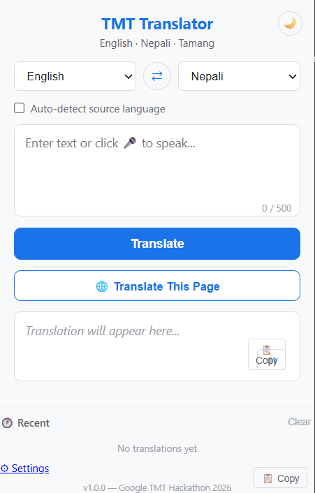

# TMT Translator v1.0

A Chrome extension for real-time translation between **English**, **Nepali**, and **Tamang**.

Built for the **Google TMT Hackathon 2026** by **Team Logic Lions**.

---

## Features

- Popup translation (all 6 language pairs)
- Select text on any webpage → floating translate button
- "Translate This Page" — live-translate visible text on any site (WhatsApp Web, Messenger, etc.)
- Keyboard shortcut: Ctrl+Shift+T
- Right-click context menu translation
- Auto-detect source language (Devanagari vs Latin)
- Multi-sentence translation with rate limiting
- Translation history (last 15 translations)
- Dark mode toggle
- Secure API key storage via chrome.storage
- One-click copy to clipboard

---

## Tech Stack

- Chrome Extension (Manifest V3)
- HTML5, CSS3, Vanilla JavaScript
- Google TMT Translation API (REST / JSON)
- Chrome Storage API, Context Menus API, Commands API, Tabs API

---

## Installation & Setup

1. Open Chrome and go to `chrome://extensions/`
2. Toggle **Developer mode** ON (top-right corner)
3. Click **Load unpacked** → select the `tmt-extension` folder
4. Pin the extension: click the 🧩 puzzle icon in the toolbar → pin **TMT Translator**
5. Click the TMT Translator icon → go to **⚙ Settings**
6. Enter your TMT API key (e.g., `team_xxxxxxxxxxxxxxxx`) → click **Save Key**

---

## User Guide

### 1. Popup Translation

1. Click the **TMT Translator** icon in your browser toolbar.
2. Select the **source** and **target** languages from the dropdowns (or check "Auto-detect").
3. Type or paste text (up to 500 characters) into the input box.
4. Click **Translate**.
5. The translated text appears below. Click **📋 Copy** to copy it to your clipboard.

### 2. Translate Selected Text (In-Page)

1. Go to any webpage.
2. Highlight any text (up to 500 characters).
3. A **🌐 TMT** floating button appears near your selection.
4. Click it — a popup shows the translated text instantly.

### 3. Translate This Page (Live Mode)

1. Click the **TMT Translator** icon in the toolbar.
2. Click the **🌐 Translate This Page** button.
3. The extension translates visible text on the current page (up to 50 elements). Original text appears as ~~strikethrough~~ and the translation appears below it in blue.
4. To restore the original text, click **↩️ Restore Original** in the popup.

### 4. Right-Click Context Menu

1. Highlight any text on a webpage.
2. Right-click → select **"Translate with TMT"**.
3. A toast notification appears at the bottom-right corner with the translation.

### 5. Keyboard Shortcut

1. Highlight any text on a webpage.
2. Press Keyboard shortcut: Ctrl+Shift+Y
3. The translation appears in a floating popup.

### 6. Auto-Detect Language

1. Open the popup and check the **"Auto-detect source language"** checkbox.
2. Paste text — the extension automatically detects if it's English or Nepali based on the script (Devanagari vs Latin) and sets the source language accordingly.

### 7. Translation History

1. Every successful translation is saved in the **🕐 Recent** section of the popup.
2. Click any history item to instantly reload the input, languages, and output.
3. Click **Clear** to erase the history.

### 8. Dark Mode

1. Click the **🌙** icon in the top-right corner of the popup (or settings page).
2. Toggle between light and dark themes. Your preference is saved automatically.

---

## Team

**Logic Lions** — Google TMT Hackathon 2026

Information and Language Processing Research Lab
Kathmandu University
