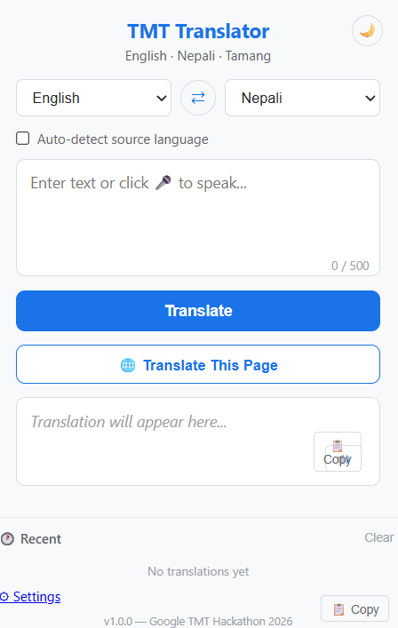

# TMT Translator v1.0

A Chrome extension for real-time translation between **English**, **Nepali**, and **Tamang**.

Built for the **Google TMT Hackathon 2026** by **Team Logic Lions**.

## Features

- Popup translation (all 6 language pairs)
- Select text on any webpage → floating translate button
- ⌨Keyboard shortcut: Ctrl+Shift+T
- Right-click context menu translation
- Auto-detect source language (Devanagari vs Latin)
- Multi-sentence translation with rate limiting
- ranslation history (last 15 translations)
- Dark mode toggle
- Secure API key storage via chrome.storage
- One-click copy to clipboard

## Setup

1. Open `chrome://extensions/`
2. Enable **Developer mode**
3. Click **Load unpacked** → select this folder
4. Click the extension icon → go to ⚙ Settings
5. Enter your TMT API key and save

## Tech

- Chrome Extension (Manifest V3)
- Google TMT Translation API
- Content Scripts + Background Service Worker

## Team

**Logic Lions** — Google TMT Hackathon 2026

